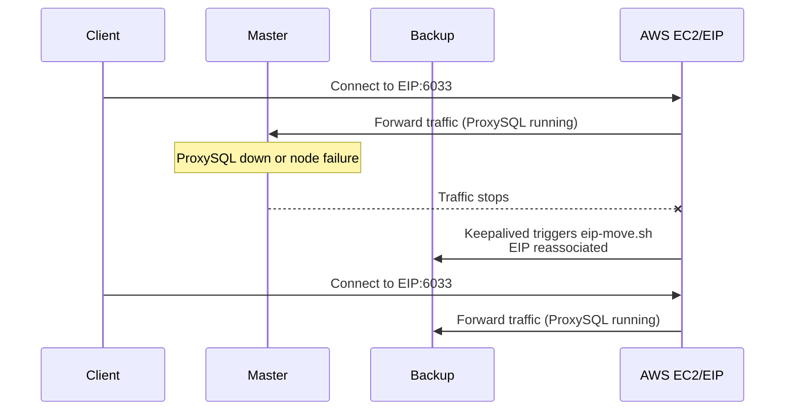
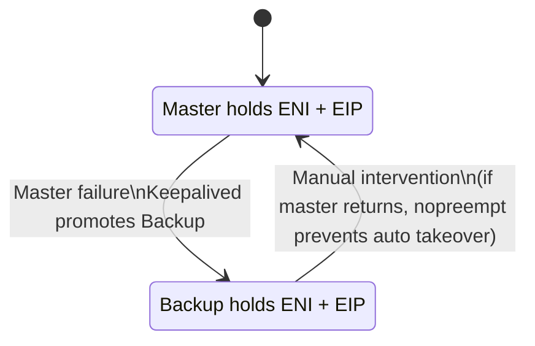

# HA with Keepalived + Elastic IP + Dedicated ENI + ProxySQL


## 📌 Overview
This repository contains automation scripts to bootstrap a **highly available database proxy layer** using:
- **Keepalived** for VRRP failover.
- **Dedicated ENI** for project separation and IP forwarding.
- **Elastic IP (EIP)** for external reachability.
- **ProxySQL** as the SQL-aware database proxy.

## 💬 Before running the setup scripts, review the aws_resources file to ensure the required resources are created in advance.

We implemented two bootstrap scripts:
- `setup_master.sh`: Configures the primary node (MASTER).
- `setup_backup.sh`: Configures the secondary node (BACKUP).
  
And two rollback scripts (BE CAREFUL):
- `rollback_master.sh`
- `rollback_backup.sh`

These ensure a clean setup and teardown, while preserving the customer-managed **EIP** and IAM roles.

---

## 🚀 Architecture

```mermaid
flowchart LR
    subgraph AWS_VPC [AWS VPC]
        subgraph Subnet_A [Subnet A]
            Master[Master Node<br/>setup_master.sh]
        end
        subgraph Subnet_B [Subnet B]
            Backup[Backup Node<br/>setup_backup.sh]
        end
        ENI[(Dedicated ENI)]
        EIP[(Elastic IP)]
    end

    EIP --> ENI
    ENI --> Master
    ENI -. failover .-> Backup
    Master <-- VRRP Keepalived --> Backup
    Master -. ProxySQL port 6033 .-> Clients
    Backup -. ProxySQL port 6033 .-> Clients
````

* **EIP** is associated with the **Dedicated ENI**.
* **Keepalived** monitors ProxySQL locally.
* On failover, Keepalived triggers the script `eip-move.sh` to reassign the EIP from MASTER to BACKUP.

---

## ⚙️ Scripts

### `setup_master.sh`

* Installs Keepalived, ProxySQL, AWS CLI.
* Creates and attaches a dedicated ENI to the master node.
* Associates the provided Elastic IP to this ENI.
* Configures Keepalived with:

  * `state MASTER`
  * `priority 2`
  * `nopreempt` to avoid flapping.

### `setup_backup.sh`

* Installs the same stack on the backup node.
* Creates or reuses the dedicated ENI, attaches it to the backup node.
* Does **not** associate the EIP initially.
* Configures Keepalived with:

  * `state BACKUP`
  * `priority 1`
  * `nopreempt` to avoid automatic reclamation.

### `rollback_master.sh` and `rollback_backup.sh`

* Stop Keepalived and ProxySQL.
* Remove configs in `/etc/keepalived/`.
* Uninstall installed packages.
* Detach and delete the dedicated ENI.
* Disassociate (but not release) the Elastic IP.

---

## 🛠️ Usage

### 1. Bootstrap the master node

```bash
chmod +x setup_master.sh
./setup_master.sh
```

### 2. Bootstrap the backup node

```bash
chmod +x setup_backup.sh
./setup_backup.sh
```

### 3. Test failover

1. Ensure EIP responds via `ping` and `nc -vz <EIP> 6033`.
2. Stop ProxySQL or shutdown the master node.
3. Observe logs on backup:

   ```bash
   journalctl -u keepalived -f
   ```
4. The backup should take over the EIP and start responding on port 6033.

### 4. Rollback

```bash
ALLOCATION_ID=eipalloc-xxxx REGION=us-east-1 ./rollback_master.sh
ALLOCATION_ID=eipalloc-xxxx REGION=us-east-1 ./rollback_backup.sh
```

---

## 📊 Failover Flow



---

## 🔄 Cluster State



* **MasterActive**: ENI + EIP bound to Master, traffic flows to Master’s ProxySQL.
* **BackupActive**: On failover, ENI + EIP move to Backup, which takes traffic.
* With `nopreempt`, once Backup takes over, it stays active until an operator intervenes.

---

## 🔒 Security Considerations

* Ensure your **Security Group** allows inbound TCP/6033 for the clients that need to connect.
* Use **IAM policies** limited to `ec2:AssociateAddress`, `ec2:DisassociateAddress`, `ec2:AttachNetworkInterface`, and `ec2:DetachNetworkInterface`.
* Avoid `0.0.0.0/0` SG rules in production unless required.

---

## 🏷️ Tags

`AWS` `Keepalived` `Elastic IP` `ENI` `ProxySQL` `High Availability` `Failover` `VRRP` `Database HA`